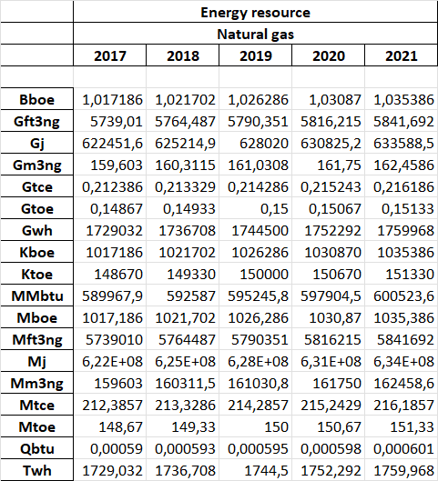
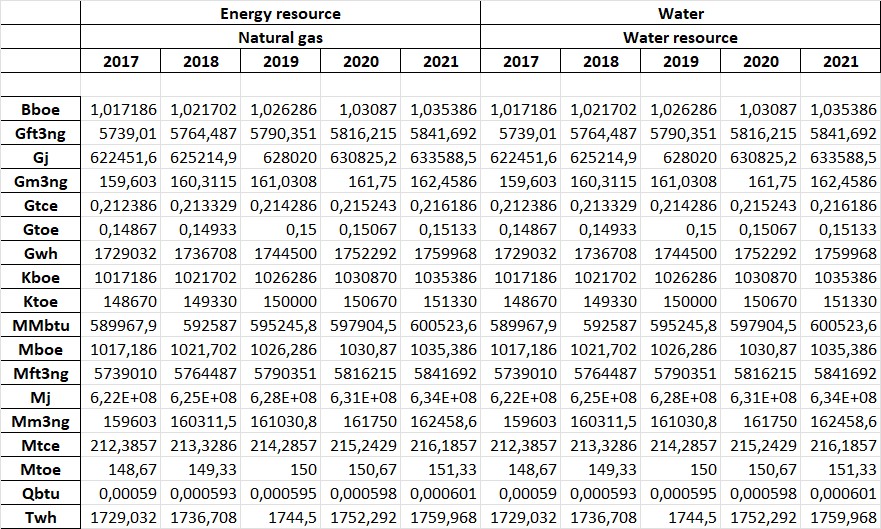
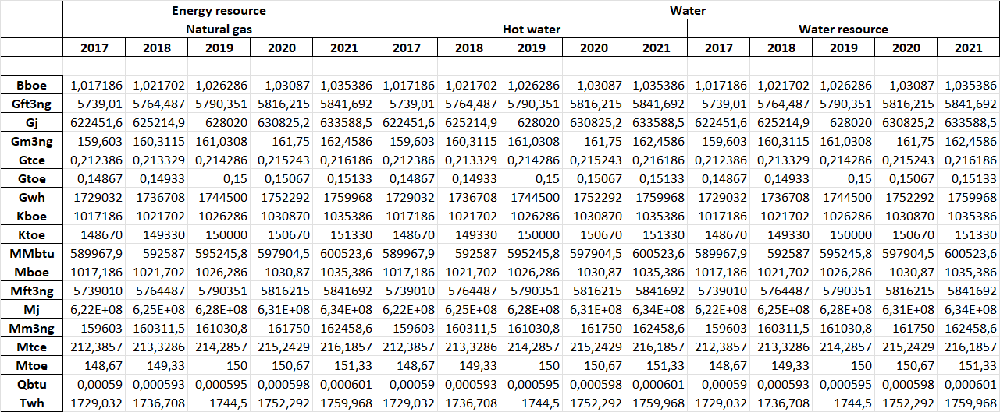

# Техническое задание по теме - _Не правильный алгоритм расчёта_.

## Проблема

> 📌 Нужно срочно решить проблему с пересчетом показателей!
> Делали все по инструкции:
> 1. Заполнили обе таблицы перевода единиц измерения (см. вложения "Таблица конвертации ЕИ",
"Таблица мультипликации ЕИ").
> 2. В таблицу значений внесли данные по совокупному конечному энергопотреблению природного газа с 2017 по 2021 годы
в единице измерения Mtoe.
> 3. Запустили расчет. Данные рассчитались некорректно – **значения в Twh отличаются от Gwh на 2 порядка** (см.
вложение "Данные TFC"), а не на 3, как должно быть. При этом в таблице перевода цифры правильные – степень Gwh -9,
степень Twh -12, разница -3. В таблице "Данные TFC" для наглядности оставил только исходные значения в Mtoe и значения
в Gwh и Twh, рассчитанные некорректно. В значениях, рассчитанных в остальных единицах измерения, ошибок не нашел,
поэтому убрал их из таблицы "Данные TFC". Прошу срочно исправить алгоритм расчета (см. вложение "Алгоритм расчета ЕИ").
>
> Также прошу максимально оптимизировать алгоритм расчета с целью повышения быстродействия.

* Все таблицы и алгоритм были получены по почте

### Сокращения

* ЕИ - Единица измерения
* T_convertation - Таблица конвертации с полями `название`, `ЕИ`, `коэффициент`, `результирующая ЕИ`
* T_multiplication - Таблица мультипликации с полями `название`, `расчёт. ЕИ`, `степень`, `базовая ЕИ`
* T_values - Таблица значений с полями `показатель`, `ресурс`, `год`, `ЕИ`, `значение`

## Для решения проблемы представлен следующий план действий

- Привести таблицу **(T_convertation)** конвертации ЕИ с полями `Исходная ЕИ` и ` Результирующая ЕИ`
  к базовой ЕИ с помощью таблицы **(T_multiplication)** мультипликации ЕИ. Если `e` не меняется то оставить коэффициент
  как есть, иначе коэффициент (k) умножить на 10 в n-ой степеней. Для примера, чтобы из значения Mtce получить Mm3ng,
  нужно посмотреть на *(e)* в таблице мультипликации, так как степени одинаковые, коэффициент не изменяется. Если же
  посмотреть на Gft3ng --> Twh, то коэффициент нужно умножить на 10**3.
  Можно вывести таблицу c полем `приставка`, `степень` и `расчёт. ЕИ`

    | Приставка | Степень | Расчётная ЕИ                        |
    |-----------|---------|-------------------------------------|
    | K         | -3      | Kboe, Ktoe                          |
    | M         | -6      | Mj, Mtoe, Mboe, Mtce, Mft3ng, Mm3ng |
    | MM        | -6      | MMbtu                               |                          
    | G         | -9      | Gft3ng, Gtce, Gtoe, Gj, Gm3ng , Gwh |
    | B         | -9      | Bboe                                |
    | T         | -12     | Twh                                 |
    | Q         | -15     | Qbtu                                |

  Таблицу конвертации после всех изменений можно представить следующим образом
    
    | name           | unit  | k           | res_unit |
    |----------------|-------|-------------|----------|
    | tce --> m3ng   | tce   | 751.4768963 | m3ng     | 
    | ft3ng --> wh   | ft3ng | 301.277062  | wh       | 
    | btu --> j      | btu   | 1055.060005 | j        |       
    | boe --> btu    | boe   | 580.00001   | btu      |    
    | toe --> tce    | toe   | 1.4285714   | tce      |    
    | j --> wh       | j     | 0.000277778 | wh       |
    | toe --> boe    | toe   | 6.8419054   | boe      |
    | m3ng --> ft3ng | m3ng  | 35.958043   | ft3ng    |

- произвести мультипликацию из искомой ЕИ -> в базовую ЕИ, например: Twh -> wh
- рекурсивно провести конвертацию, пока wh != toe (Базовой ЕИ Mtoe). 
В случае с нахождением Twh: wh -> j -> btu -> boe -> toe.
- получить значение **Twh**

* Для работы алгоритма предварительно таблицу T_values нужно заполнить данными `показатель`, `ресурс`, `год`, `ЕИ`, 
`значение`, где ЕИ = Mtoe.
* Все данные должны быть заполнены (NOT NULL)

## Примерный алгоритм

1. Получить массив таблицы значений T_values
2. Получить массив таблицы мультипликаций T_multiplication
3. Получить массив таблицы конвертаций T_convertation
4. Из таблицы мультипликаций T_multiplication получить массив расчётной ЕИ по полю `расчёт. ЕИ`
5. Из таблицы конвертаций T_convertation получить массив результирующей ЕИ по полю `результ. ЕИ`
6. Создаем транзакцию операций. Если ошибок нет, сохраняем изменения в таблице(commit), иначе отменяем(rollback).
   + 6.1. Через цикл получаем(row) последующие данные массива T_values со значениями indicator, resource, year, unit,
value.
     + 6.1.1. Через цикл получаем каждую ЕИ необходимую для получения значения
получаем все значения из таблицы T_multiplication, где результирующая ЕИ равняется искомой.
       + 6.1.1.1. Через мультипликацию, получаем преобразованное значение(value) умноженное на
10 в степени `е` и базовую ЕИ из Mtoe(base_unit).
       + 6.1.1.2. Далее рекурсивно подвергаем конвертации результ. ЕИ и значение пока результ. ЕИ не будет равна `toe`,
так как это баз. ЕИ для Mtoe.
       + 6.1.1.3. А именно, если результ. ЕИ равно `toe`, то вернуть результ. ЕИ и значение, иначе получить базовую 
ЕИ из массива, где результ. ЕИ равны
       + 6.1.1.4. Записываем полученное значение искомой ЕИ в следующем виде `indicator`, `resource`, `year`
(все из переменной row), `unit`(искомая ЕИ в цикле), `value`
7. Конец алгоритма

## Реализация алгоритма(автоматизация)

- клонируем git репозиторий

```bash
git clone https://github.com/ArtemIsmagilov/calculate_resources.git & cd calculate_resources
```

- создаём виртуальное окружение

```bash
python3 -m venv venv & source/venv/bin/activate
```

- устанавливаем зависимости

```bash
pip install -r requirements.txt
```

- Если вы заполнили таблицы по инструкции выше, то запускаем скрипт

```bash
python3 run.py
```

- Выгрузить таблицу(T_values) в xlsx формат(excel)

```bash
python3 save_values_to_excel.py
```

- Запустить тесты

```bash
pytest -vv test_sample.py 
```

### test0



### test1



### test2



## Задумки

* Можно скрипт реализовать в виде десктоп программы
